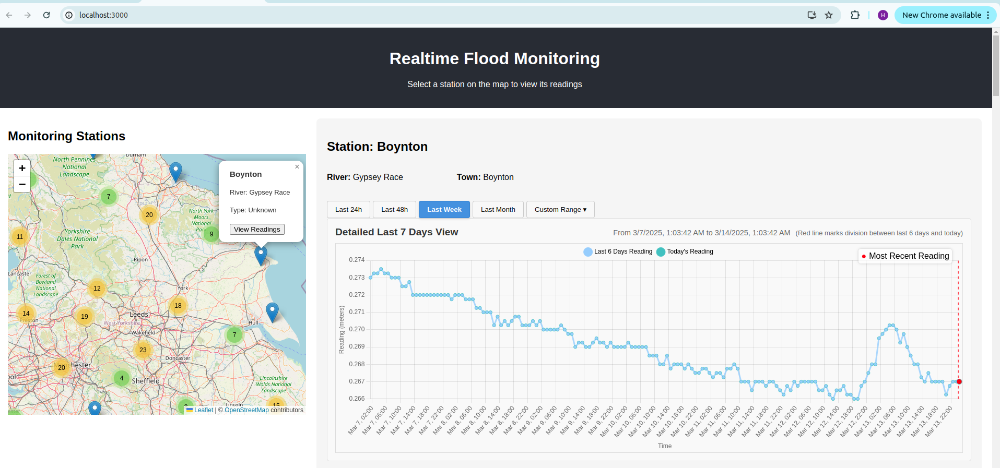
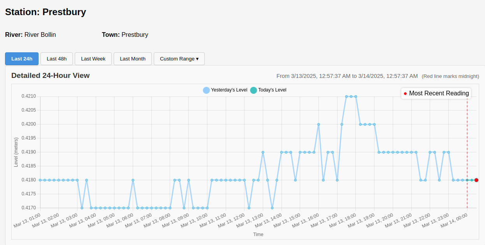
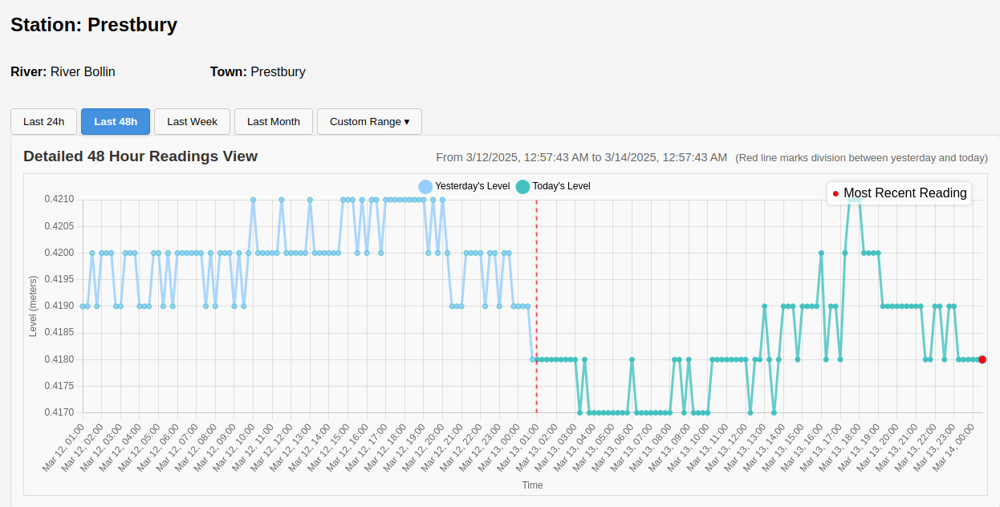
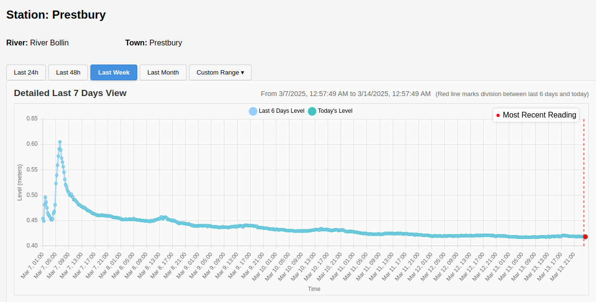
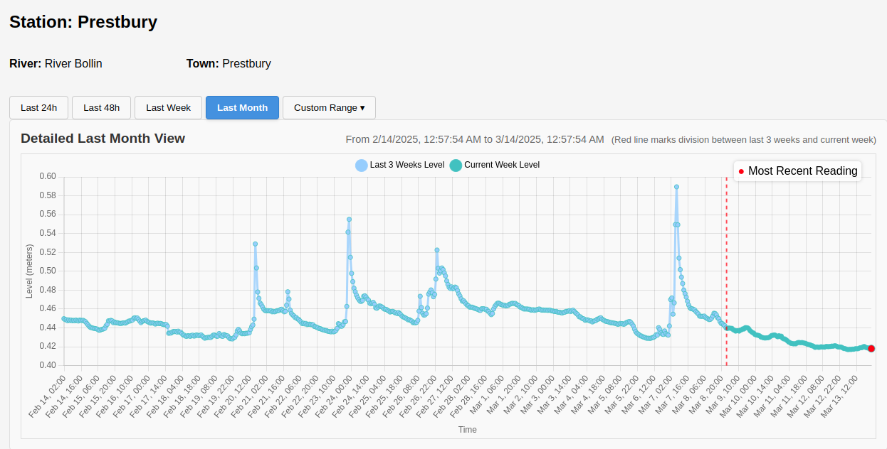
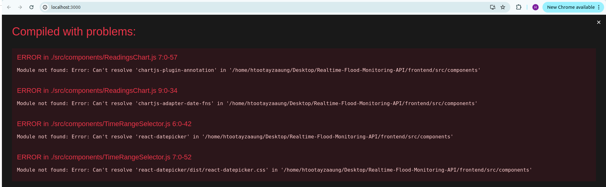

# Realtime Flood Monitoring System

## Overview

The Realtime Flood Monitoring System is a web application that provides real-time flood monitoring using a backend API and a frontend interface. The project consists of a **backend (Flask API)** and a **frontend (React app)**.



The image above showcases the web application's UI, displaying monitoring stations and water level trends.

---

## Installation and Setup

### **1. Clone the Repository**

```bash
cd ~/Desktop  # Navigate to your preferred directory
git clone https://github.com/htootayzaaung/Realtime-Flood-Monitoring-API.git
cd Realtime-Flood-Monitoring-API
```

---

## **Backend Setup (Flask API)**

### **2. Create a Conda Environment**

```bash
conda create --name flood-monitoring python=3.10
conda activate flood-monitoring
```

### **3. Install Backend Dependencies**

```bash
cd backend
pip install -r requirements.txt
```

### **4. Run the Backend**

```bash
python run.py
```

By default, the backend runs on [**http://127.0.0.1:5000/**](http://127.0.0.1:5000/).

---

## **Frontend Setup (React App)**

### **5. Install Node.js and npm**

#### **MacOS (Using Homebrew):**

```bash
brew install node
```

#### **Linux (Ubuntu/Debian-based distros):**

```bash
sudo apt update
sudo apt install nodejs npm
```

#### **Alternative: Install via nvm (Recommended)**

```bash
curl -fsSL https://raw.githubusercontent.com/nvm-sh/nvm/v0.39.4/install.sh | bash
source ~/.zshrc  # (or source ~/.bashrc for Linux users)
nvm install node
```

### **6. Install Frontend Dependencies**

```bash
cd ../frontend
npm install
```

### **7. Open Two Terminals and Run the Application**

To run both the backend and frontend at the same time, open **two separate terminals**:

- **Terminal 1 (Backend)**:
  ```bash
  cd backend
  python run.py
  ```
- **Terminal 2 (Frontend)**:
  ```bash
  cd frontend
  npm start
  ```

By default, the frontend runs on [**http://localhost:3000/**](http://localhost:3000/). Open this link in a web browser such as **Mozilla Firefox** or **Google Chrome**.

---

## **Expected Output Screenshots**

### **Monitoring Stations Overview**


The application allows users to select monitoring stations on a map to view real-time flood level readings.

### **Water Level Readings (Last 24 Hours)**



This graph displays the detailed 24-hour water level trend for a selected station.

### **Water Level Readings (Last 48 Hours)**



Shows the last 48-hour water level trend, highlighting variations over two days.

### **Water Level Readings (Last 7 Days)**



The water level trend over the past 7 days, useful for identifying patterns and trends.

### **Water Level Readings (Last Month)**



Displays the water level fluctuations over the past month.

---

## **Troubleshooting**

### **Missing Module Errors**

If you see errors related to missing modules like `chartjs-plugin-annotation`, `chartjs-adapter-date-fns`, or `react-datepicker`, run:

```bash
npm install chartjs-plugin-annotation chartjs-adapter-date-fns react-datepicker
```

#### Example Error Output:


### **Dependency Conflict Errors (React Versions)**

If you encounter errors related to `react-leaflet-cluster` or `react-leaflet`, follow these steps:

```bash
npm install react@18 react-dom@18 react-leaflet@4 react-leaflet-cluster@2.1.0
npm install
npm start
```

If conflicts persist, try forcing installation (use cautiously):

```bash
npm install --legacy-peer-deps
```

### **Other Issues (Reinstalling Dependencies)**

If issues persist, remove `node_modules` and reinstall everything:

```bash
rm -rf node_modules package-lock.json
npm install
npm start
```

---

## **Contact**

For questions or support, feel free to reach out to **htootayzaaung.01@gmail.com**.
